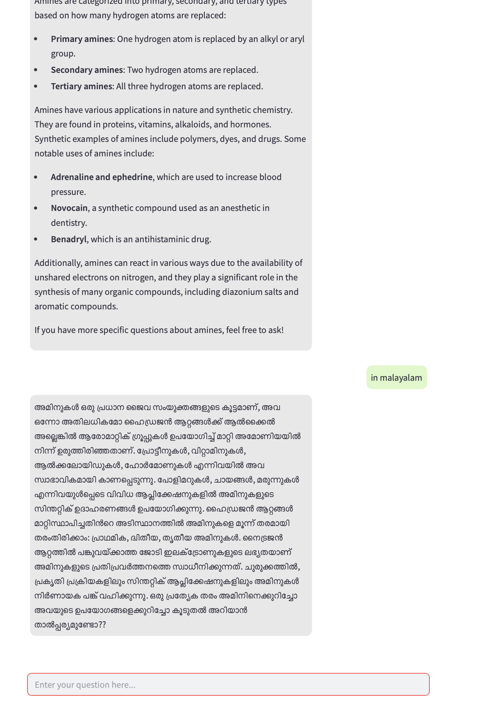

## Usage

1. Install requirements
   
2. Generate Embedding and create vector store
   ```
   python3 build_vector_store.py
   ```

3. Start the FastAPI backend:
   ```
   uvicorn main:app --reload
   ```

4. Launch the Streamlit UI:
   ```
   streamlit run streamlit_app.py
   ```

5. Open your web browser and navigate to the Streamlit app URL (typically `http://localhost:8501`)

## Textbooks
Textbooks from various grades and subjects are stored in specific hierarchy inside the data folder. They are parsed for embedding and stored in vector stores for RAG to make use of these documents. The data directory contains textbooks in this format,

* data/
  * grade_xx/
    * subject
      * cc_chapter1name
      * cc_chapter2name

xx - grade number, cc - chapter number

## Data Ingestion and Chunking
The script "build_vector_store.py" scans the 'data/' directory for PDF files. For each PDF, it extracts relevant metadata such as grade, subject, and chapter from the filepath. The text content of each PDF is then split into manageable chunks to facilitate efficient retrieval and embedding.

## Embedding Generation
Each text chunk is converted into a high-dimensional vector representation using OpenAI's embedding model (text-embedding-3-small). This process enables semantic search, allowing the system to retrieve content based on meaning rather than exact keyword matches.

## Vector Store Creation
All embedded document chunks are stored in a FAISS vector store, which is optimized for fast similarity search. This vector store serves as the backbone for the Retrieval-Augmented Generation (RAG) pipeline, enabling the system to quickly find and retrieve the most relevant content in response to user queries.

The resulting vector store is saved locally in the 'vector_store' directory for efficient loading and reuse during inference.

## Question Generation (QG)

For generating pedagogically relevant questions, the system employs a T5 model. This model is fine-tuned using multiple strategies, including Parameter-Efficient Fine-Tuning (PEFT) and GPT-4-based self-instruct tuning. The combination of PEFT with self-instruct emerged as the most effective approach, consistently achieving higher accuracy, better lexical alignment, and greater question diversity.

### QG Model Evaluation

The quality of generated questions is assessed using three complementary automatic metrics:
*   **BERT-F1**: Measures semantic similarity between generated questions and reference answers. Scores consistently around 0.85 indicate strong semantic grounding.
*   **ROUGE-L**: Evaluates lexical overlap. Moderate scores (0.20–0.24) reflect the open-ended nature of question generation while retaining relevance.
*   **Self-BLEU (BLEU-2)**: Assesses diversity in question formulation. Lower scores (typically <0.35 for PEFT-tuned models) indicate desirable diversity and less templated output, distinguishing it from full fine-tuning which showed signs of mode collapse.

These evaluations confirm the model's capability to generate semantically sound, context-aware, and lexically diverse questions suitable for the NCERT curriculum.

## Translation

The system incorporates a robust translation pipeline to provide multilingual responses, primarily in Indian languages. It utilizes **Sarvam Translate V1**, a dedicated model optimized for efficient translation into Indic languages, chosen for its superior performance over general-purpose large language models in this domain.

The process involves:
1.  The Router Agent classifying the user query for translation.
2.  A RAG pipeline first generates a high-quality English response based on the retrieved context.
3.  This English output is then passed to the translation chain, which uses Sarvam Translate V1 to convert it into the user-specified Indic language (e.g., Hindi, Tamil, Kannada, Malayalam).

### Translation Model Evaluation

A comparative benchmarking study was performed to determine the optimal translation model. Llama, GPT-4o, and Sarvam models were evaluated across two distinct datasets:
*   **Dataset 1**: AIKOSH (English to Hindi/Malayalam/Tamil/Kannada).
*   **Dataset 2**: Custom-created dataset of 10 entries of English to Malayalam from SCERT Kerala English and Malayalam medium textbooks, which proved more domain-relevant.

Evaluation used **BLEU** and **METEOR** metrics, alongside anecdotal human assessment. While initial tests on Dataset 1 showed GPT-4o performing well, human review consistently favored Sarvam AI. On the more domain-relevant Dataset 2, Sarvam AI clearly performed best in both automated tests and human review, confirming its suitability for the application's translation needs.


## Demo





